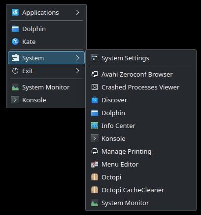
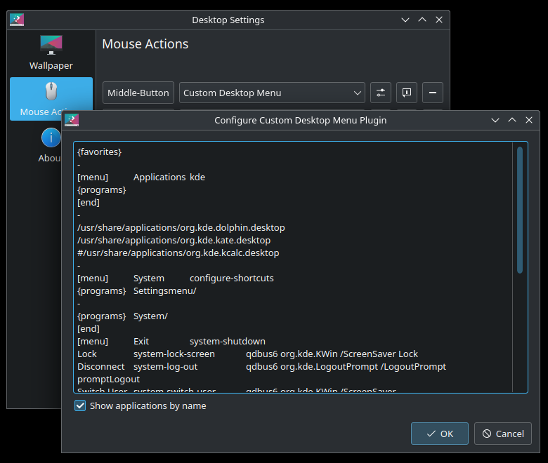

# plasma-containmentactions-customdesktopmenu

Custom desktop menu for Plasma 6




## Build and install

### Prerequisites

- extra-cmake-modules >= 6.0.0
- kdeplasma-addons >= 6.0.0

Archlinux :
```
pacman -S --needed base-devel cmake extra-cmake-modules kdeplasma-addons
```

### Build

```
cd src
cmake --fresh -B ../_build .
cd ../_build
make clean
make
```

### Install / Update

```
chmod 755 bin/plasma/containmentactions/matmoul-customdesktopmenu.so
sudo cp bin/plasma/containmentactions/matmoul-customdesktopmenu.so /usr/lib/qt6/plugins/plasma/containmentactions
```

## Other

- When you update the library, KWIN crash and restart with the new library.
- Favorites is not yet implemented.

## Sources

- https://github.com/MatMoul/plasma-containmentactions-customdesktopmenu/tree/plasma5
- https://invent.kde.org/plasma/plasma-workspace/-/tree/ea415539fc6256494d5c12296a6216e522e12b0a/containmentactions
- https://invent.kde.org/plasma/plasma-workspace/-/blob/master/applets/kicker/plugin/kastatsfavoritesmodel.cpp?ref_type=heads
